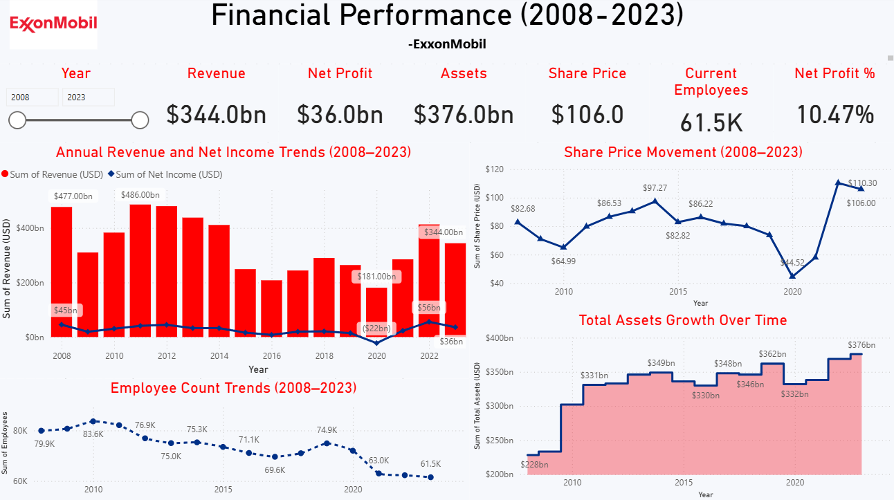

# ExxonMobil Financial Performance Dashboard (2008–2023)

## Project Overview

This project analyzes **ExxonMobil’s financial performance from 2008 to 2023** using an interactive **Power BI dashboard**.

The objective of the dashboard is to explore how ExxonMobil’s **revenue, profitability, assets, workforce, and share price evolved over time**, and how global events such as **oil price fluctuations and economic disruptions** impacted the company’s financial performance.

The dashboard provides a **high-level financial overview and highlights key business trends through data visualization.**

---

## Dashboard Preview

---

# Business Questions Answered by the Dashboard

## 1. How has ExxonMobil’s revenue and profitability changed over time?

The dashboard compares **annual revenue and net profit** from 2008 to 2023.

Key insights:

- Revenue peaked during the **early 2010s oil boom**.
- A decline occurred between **2014–2016** due to falling oil prices.
- ExxonMobil experienced a **net loss in 2020** as global oil demand collapsed during the pandemic.
- Financial performance recovered strongly between **2021 and 2023** as energy demand rebounded.

This visualization demonstrates how ExxonMobil’s profitability closely follows **global energy market cycles**.

---

## 2. How did the stock market respond to ExxonMobil’s performance?

The **share price trend chart** illustrates how investor sentiment changed over time.

Observations:

- Stock prices dropped sharply during **2020**, reflecting uncertainty in the energy market.
- From **2021 onward**, the stock price surged as global energy demand increased.
- The strong recovery highlights renewed investor confidence in the energy sector.

---

## 3. How has ExxonMobil’s asset base evolved?

The **total assets chart** shows ExxonMobil’s long-term balance sheet growth.

Key observations:

- Total assets increased from **$228 billion in 2008 to $376 billion in 2023**.
- Asset growth reflects ongoing investments in **energy infrastructure, exploration, and production capacity**.
- Periods of slower growth coincide with downturns in the global oil market.

---

## 4. How has the workforce changed over time?

The **employee count visualization** tracks ExxonMobil’s workforce trends.

Insights:

- Workforce size peaked around **2010–2011** during a period of expansion.
- A gradual decline followed due to **operational restructuring and efficiency improvements**.
- By 2023, employee numbers had decreased significantly, indicating increased focus on **automation and cost optimization**.

---

## 5. What is the company’s current financial snapshot?

The dashboard includes **key performance indicators (KPIs)** that summarize ExxonMobil’s latest financial position:

- Revenue
- Net Profit
- Total Assets
- Share Price
- Employee Count
- Net Profit Margin

These KPIs provide a **quick overview of the company’s financial health**.

---

# Key Insights from the Analysis

- ExxonMobil’s financial performance is highly influenced by **global oil price cycles**.
- The company experienced a major disruption during the **2020 global pandemic**.
- Financial performance rebounded strongly between **2021 and 2023**.
- Workforce reductions suggest a focus on **operational efficiency and cost management**.
- Asset growth indicates **long-term investment in energy infrastructure**.

---

# Analytical Methodology

The analysis followed a structured approach to transform raw financial data into meaningful insights.

## Data Preparation

The dataset was organized into a **time-series format** covering the years 2008–2023. Financial metrics were standardized to ensure consistent analysis.

## Metric Development

Key financial metrics were calculated to evaluate company performance.

Example:

**Net Profit Margin = Net Profit / Revenue**

This metric measures how efficiently ExxonMobil converts revenue into profit.

## Time Series Analysis

The dashboard focuses on **trend analysis across a 15-year period**, allowing users to observe long-term patterns, economic disruptions, and recovery phases.

## Visualization Strategy

Different chart types were selected to answer specific analytical questions:

- **Bar + Line Chart:** Revenue vs Net Profit comparison
- **Line Chart:** Share price trends
- **Area Chart:** Asset growth over time
- **Line Chart:** Employee count changes

Each visual highlights **patterns, turning points, and long-term trends**.

---

# Tools Used

- **Power BI** – Data visualization and dashboard development  
- **Data analysis and trend exploration**

---

# How to Use the Dashboard

1. Download the `.pbix` file from this repository.
2. Open the file using **Microsoft Power BI Desktop**.
3. Use the **Year filter** to explore financial trends across different periods.
4. Interact with charts to analyze revenue, profitability, assets, and workforce changes.

---

# Author

**Aakash Gopalakrishnan**  
Data Analyst | Power BI | SQL | Excel
